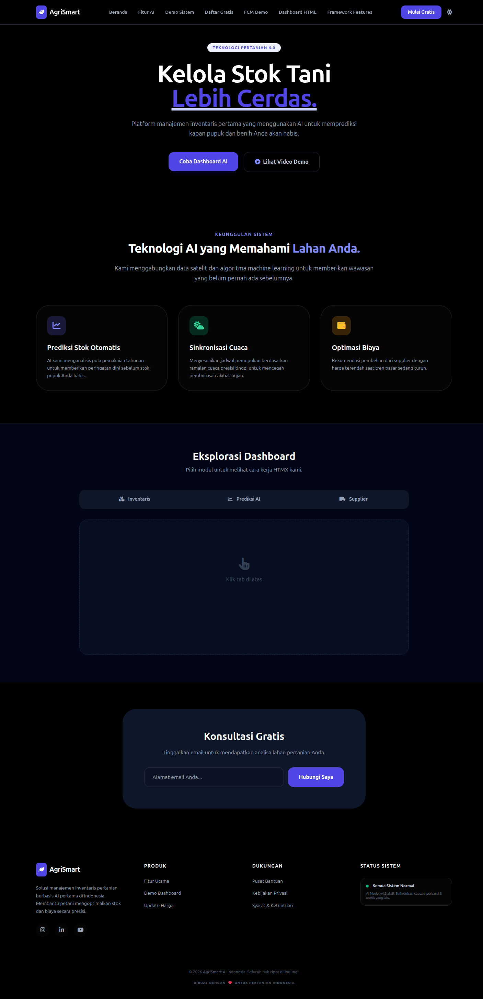
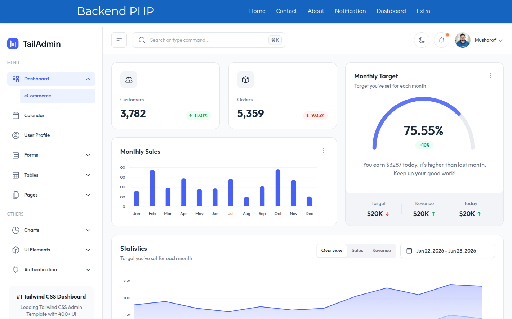
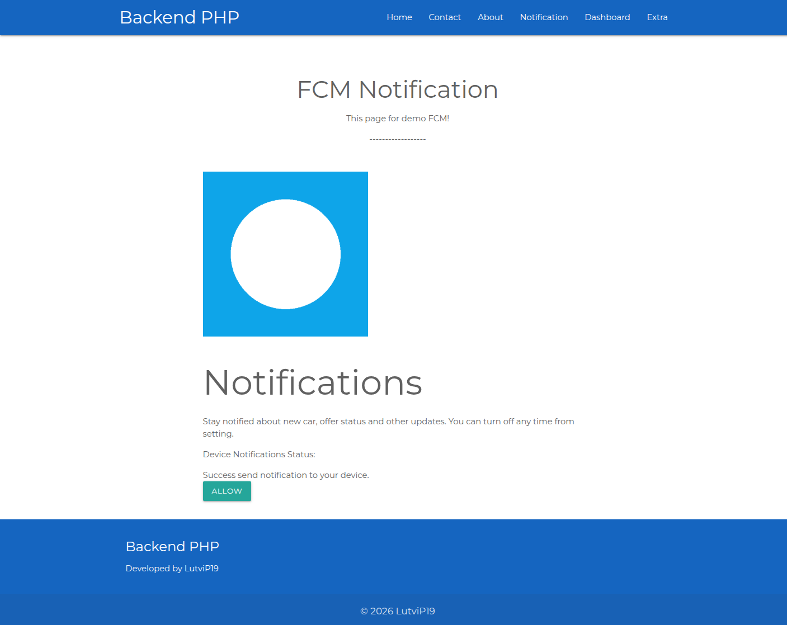

# Backend PHP - Framework

A lightweight, high-performance PHP framework built on modern architecture patterns. It is specifically designed for microservices architecture and high-concurrency environments using native OpenSwoole.

## Key Features

- **Modern Architecture:** Built on contemporary modern PHP standards, optimized for clean, scalable microservices integration.
- **Production-Ready Performance:** Native OpenSwoole support ensures asynchronous, non-blocking execution capable of handling high-concurrency and heavy traffic loads.
- **Developer Experience:** Comes pre-packaged with built-in benchmarking tools, native Pest testing integration, and easy Docker services.

---

## Demo Preview

### Homepage
 

### Dashboard
 

### FCM Notification Management
 

---

## Prerequisites & System Requirements

Before setting up the framework, ensure your local machine meets the minimum runtime, infrastructure, and network requirements detailed below.

### 1. Core Core Runtimes & Environments
* **PHP 8.3+** (Must include `redis`, `ffi` and `openswoole` extensions enabled in your `php.ini`).
* **[OpenSwoole 22.x+](https://openswoole.com/docs/get-started/installation)** (Required for running high-concurrency HTTP/WebSocket servers).
* **Docker Desktop** (Required if you choose to spin up infrastructure dependencies via containers. Compatible with macOS, Windows, and Linux).

### 2. Databases & Infrastructure Services
You can install these directly on your host machine or run them instantly via the provided Docker containers:
* **Primary Relational Database:** MySQL 8.0+ or SQLite 3.x (Used for relational data storage and user migrations).
* **Redis Server:** Redis CLI / Server 7.x+ (Handles rapid caching, session storage, and pub/sub routines).
* **RabbitMQ:** RabbitMQ 3.12+ (Acts as the robust enterprise message broker for processing background microservices jobs).
* **Mailpit:** (SMTP testing sandbox to capture and view outgoing emails locally without hitting real servers).

### 3. Network Port Allocations
The framework boots up multiple isolated server instances simultaneously. Ensure the following network ports are vacant and not bound by other native services (like native Apache, Nginx, or local MySQL instances):

| Service Node | Default Port | Protocol | Purpose / Target Destination |
| :--- | :--- | :--- | :--- |
| **Web Application** | `8009` | HTTP | Local web asset rendering and user frontend router |
| **API Router** | `8080` | HTTP | Asynchronous API router and long-lived HTTP traffic handler |
| **WebSocket Engine** | `9501` | WebSocket | Socket connections and long-lived HTTP traffic handler |
| **Socket Engine** | `9502` | TCP / HTTP | Live streaming bidirectional socket connections and relays |

> 💡 **Troubleshooting Tip:** If you get a `Bind address already in use` error when starting up the servers, run `lsof -i :<port>` (macOS/Linux) or `netstat -ano | findstr <port>` (Windows) to identify and stop the blocking application.

---

## Quick Start Installation

Follow these steps to get your local environment up and running smoothly.

### Step 1: Install Dependencies & Environment
Clone the repository, download the vendor packages, and initialize your environment configurations:
```bash
# Install PHP package dependencies
composer install

# Create your local environment file
cp .env.example .env
```

### Step 2: Initialize the Database
Import the schema files into your MySQL or SQLite database instance:
1. **Schema Definition:** Execute the SQL file found at `storage/database/migrations/mysql/user.sql` to create the `users` table.
2. **Seed Sample Data:** Execute the SQL file found at `storage/database/seeders/mysql/insert_user.sql` to populate initial test users.

### Step 3: Launch Docker Services
Start the supporting backend infrastructure using Docker Compose. Use the `-f` flag to point to the specific configuration files:

```bash
# Start Redis (Caching & Session Management)
docker compose -f docker-compose/redis/docker-compose.yaml up -d

# Start RabbitMQ (Message Broker & Queueing)
docker compose -f docker-compose/rabbitmq-python/docker-compose.yaml up -d

# Start Mailpit (Local Email Testing Sandbox)
docker compose -f docker-compose/mailpit/docker-compose.yml up -d

# Start the Web Dashboard Core Service Monitoring (Prometheus & Grafana)
docker compose -f docker-compose/dashboard/docker-compose.yml up -d
```
*Note: Remove the `-d` flag if you prefer to watch the streaming logs directly in your terminal window.*

### Step 4: Boot Up the Application Server
Choose one of the execution methods below to launch your web interface:

#### Option A: Standard PHP Built-in Server (Development Only — Synchronous / Single-Threaded)
```bash
php -S localhost:8008 -t public/
```

#### Option B: Asynchronous OpenSwoole Engine (Recommended)
Open multiple terminal windows or run them concurrently:
```bash
# Start the Web Frontend Engine
php servers/web-server.php

# Start the REST API Engine
php servers/api-server.php

# Start the Cronjob with PHP (Strean Server)
php servers/phpstream-server.php

# Web Socket (Coming Soon)
php servers/http-server.php
```

---

## CLI Console Commands

The framework features an interactive CLI console application to interact with system components.

### Core Console Scripts
```bash
# Simulates message listener triggers for a specific user ID
php bin/console app:testing <userid>

# Displays detailed system environment metadata filtered by user ID
php bin/console app:info <userid>

# Complete automatic framework setup initializer (Feature In Progress)
php bin/console app:setup
```

### Developer Helper Tools
```bash
# Generates local Self-Signed SSL/TLS certificates for HTTPS development
bin/mkcert

# Runs automated stress tests and benchmarks on OpenSwoole endpoints
php bin/benchmark

# Executes unit and feature tests using the Pest Framework suite
php bin/pest

# Advanced binary extensions to accelerate engine speed (Coming Soon)
bin/ffi/*
```

---

## System Logs

All internal application logs are captured as flat streams separated by level under `storage/logs/`:

* 🛑 **Critical Exceptions:** `storage/logs/app_error.log`
* 🪲 **Verbose Debug Variables:** `storage/logs/app_debug.log`
* ℹ️ **General Information Audit:** `storage/logs/app_info.log`

---

## Extended Documentation

* For explicit feature testing scripts and API usage endpoints, see [DEMO.txt](DEMO.txt).
* For structural pipelines, framework architectural notes, and guidelines, see [DEV.txt](DEV.txt).

---

> ⚠️ **Development Status Warning**  
> This framework is currently under active development. Production rollouts require additional code hardening, custom firewall parameters, and strict production-level environment settings.
